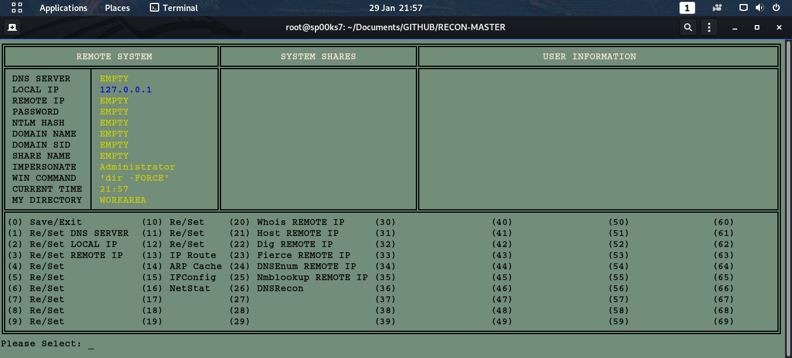

# RECON MASTER
## A PYTHON SCRIPT FILE TO REMOTELY LOCALLY AND REMOTELY ANALYSE NETWORK SETTINGS.

Usage: python ReconMaster.py

| LANGUAGE  | FILENAME         | MD5 Hash                         |
|------     |------            | -------                          |
| python    | ReconMaster.py   |                                  |

    [+] Programming stage.
    [-] Testing stage.

A python script file to locally and remotely explore network settings.

### CONSOLE DISPLAY

Found this project useful, or would like to see it amended in some way - make a donation.
https://paypal.me/TerenceBroadbent

